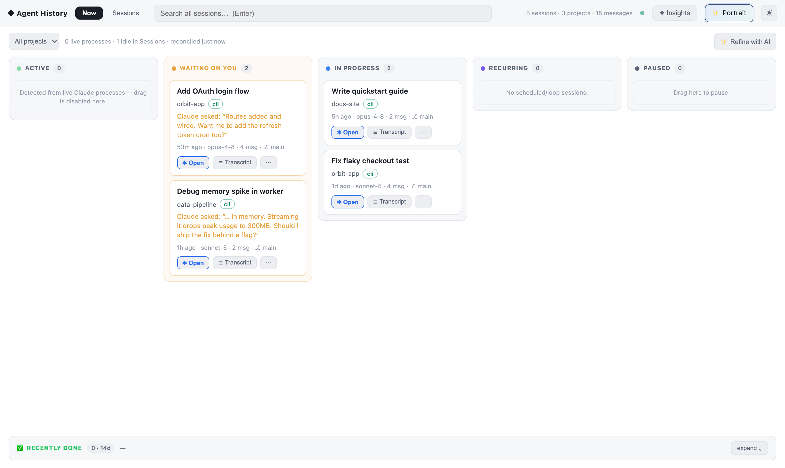
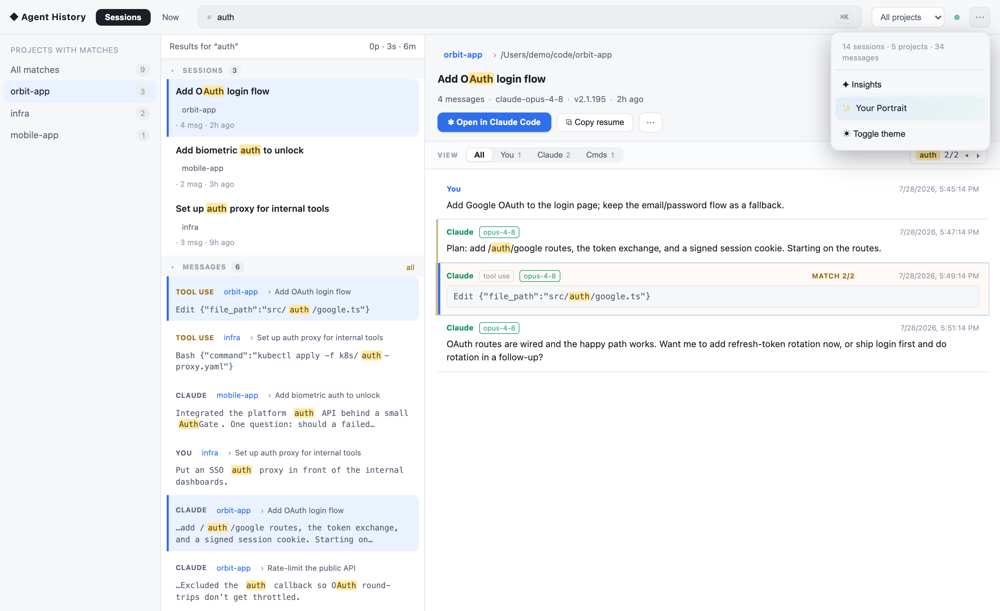

# Agent History

**Every agent session, one board.** A local-first task board + searchable librarian for your
**Claude Code** and **Codex** sessions — live status, full-text search over every transcript,
click-to-jump, and one-click resume.

```bash
npx agent-history-cli
```

That's it. It indexes your local session transcripts (~30s for a few hundred sessions) and opens
the dashboard at `http://127.0.0.1:4600`.



## Why

If you run many agent sessions — some finished, some waiting on you, some still running — the
state of your work is scattered across terminal windows, IDE tabs, and thousands of transcript
files. Agent History reads what the agents already wrote to disk and turns it into:

- **Now** — a task board of your sessions: 🟢 Active (detected from live processes — never guessed),
  🟡 Waiting on you (the agent asked a question or has queued prompts), In progress, Recurring,
  Paused, Recently done. Drag to set status; your choices always beat auto-inference (🔒).
- **Sessions** — the librarian: every session grouped by project, full-text search (BM25) over
  **all** message text — your prompts, the agent's output, commands, tool results — with
  click-to-jump into the exact message, keyword-highlighted.
- **Open in Claude Code** — hands a session back to the live tool: focuses the right VS Code /
  Cursor window and resumes it there, or opens a terminal running `claude --resume` in the right
  folder.
- **Insights** — what you worked on, plus an evidence-linked "context book" of how you work that
  you can paste into any CLAUDE.md.



## What it reads

| Source | Where | |
|---|---|---|
| Claude Code (CLI + VS Code/Cursor extension) | `~/.claude/projects/**/*.jsonl` | read-only |
| Claude desktop app (Cowork / local agents) | `~/Library/Application Support/Claude/…` | read-only |
| Codex (CLI / ChatGPT desktop) | `~/.codex/sessions/**` | read-only |

Your index also **outlives Claude Code's 30-day transcript cleanup** — anything indexed once stays
searchable forever.

## Privacy — the important part

- **100% local.** No server, no account, no telemetry, zero network calls for core features.
  The index is a SQLite file in `~/.claude/.agent-manager/`.
- **Read-only** over the agents' files. It never modifies a transcript.
- **AI features are strictly opt-in** ("✨ Refine with AI", persona extraction): they run through
  **your own** logged-in `claude` or `codex` CLI on your machine, show you exactly how many calls
  they'll make before running, are capped per day, and never send tool outputs — only short
  head/tail excerpts of conversation text.

## Requirements

- Node.js ≥ 20 (uses `better-sqlite3` — prebuilt binaries for common platforms)
- macOS or Linux (Windows: search/board work; "Open in Claude Code" handoff is macOS-only for now)
- Claude Code and/or Codex installed with existing sessions

## CLI

```
agent-history-cli                     index + open the dashboard (default)
agent-history-cli index [--force]     build/refresh the index
agent-history-cli status              corpus stats + recent sessions
agent-history-cli search <query>      full-text search (--project, --role, --kind filters)
agent-history-cli serve [--port N]    dashboard only
agent-history-cli retro [--days 7]    what you worked on
agent-history-cli persona …           the context-book layer (see --help)
agent-history-cli mcp                 MCP server: give YOUR agents your history + context book
```

(Installed globally, the short aliases `agenthistory` and `agent-history` work too.)

The MCP server means your agents can use this too — Claude Code (or any MCP client) can search
your past sessions and read your context book live:

```bash
claude mcp add -s user agent-history -- npx agent-history-cli mcp
```

## VS Code / Cursor extension

The dashboard also ships as an activity-bar panel (thin client — it auto-starts the same local
service). Grab `agent-history-*.vsix` from [Releases](https://github.com/LinnkLabs/AgentHistory/releases)
and: `code --install-extension agent-history-*.vsix`

## Troubleshooting

- **`better-sqlite3` build error on install** — your Node version may lack a prebuilt binary.
  Use Node 20/22 LTS (`nvm use 20`) and retry. (WASM fallback is on the roadmap.)
- **Empty board / no sessions** — check that `~/.claude/projects` exists and has `.jsonl` files;
  run `agent-history-cli index --force` and watch for errors.
- **The transcript format is Anthropic-internal and changes** — the parsers are
  skip-on-unknown-type by design; if a new Claude Code release breaks parsing, `index --force`
  after updating usually fixes it. Please file an issue with the CLI version.

## Demo data

Want to try it without your own sessions, or take screenshots safely?

```bash
node service/scripts/make-demo.mjs /tmp/ah-demo
CLAUDE_TRANSCRIPT_PATH=/tmp/ah-demo/projects AGENT_MANAGER_HOME=/tmp/ah-demo/store npx agent-history-cli
```

## License

MIT. Not affiliated with Anthropic or OpenAI; reads only your own local files, under your control.
